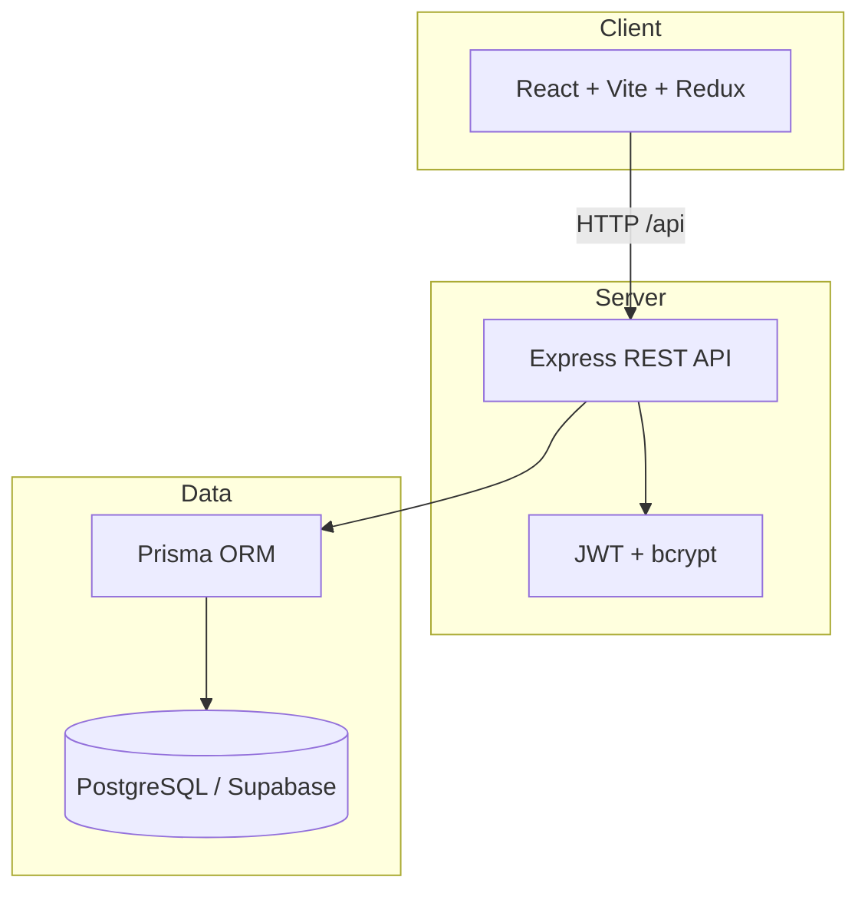

<div align="center">

# 🛒 ShopVerse

### A modern, full-stack ecommerce platform — built for speed, scale, and real-world shopping.

[](https://react.dev/)
[](https://vitejs.dev/)
[](https://nodejs.org/)
[](https://www.postgresql.org/)
[](https://www.prisma.io/)
[](https://tailwindcss.com/)

**Mobile-first UI · JWT Auth · Admin Dashboard · 50+ seeded products · Stripe-ready payments**

[Features](#-features) · [Quick Start](#-quick-start) · [Demo](#-demo-access) · [API Docs](./docs/API.md) · [Author](#-about-the-author)

</div>

---

## ✨ Overview

**ShopVerse** is a production-grade ecommerce application inspired by modern marketplaces like Amazon and Flipkart. It ships with a complete customer storefront, secure authentication, cart & checkout flows, and a powerful admin panel — all backed by a REST API and PostgreSQL database.

| | |
|---|---|
| 🏪 **Storefront** | Browse, search, filter, wishlist, reviews, responsive on mobile & tablet |
| 🔐 **Auth** | Register, login, JWT + refresh tokens, roles, password reset |
| 🛍️ **Commerce** | Cart, coupons, tax & shipping, mock/Stripe checkout, invoices |
| 📊 **Admin** | Analytics, products (add/edit), orders, users, reviews, coupons, banners |

---

## 🏗️ Architecture



```
ecommerce/
├── frontend/          # React 19 · Vite · Tailwind v4 · Redux Toolkit
├── backend/           # Express 5 · JWT · validation · rate limiting
├── prisma/            # Schema · migrations · seed (50+ products)
├── docs/              # API reference · deployment guide
└── .env               # Secrets (not committed — use .env.example)
```

---

## 🧰 Tech Stack

| Layer | Technologies |
|-------|----------------|
| **Frontend** | React 19, Vite 6, Tailwind CSS v4, Redux Toolkit, React Router, Axios, Recharts |
| **Backend** | Node.js, Express 5, JWT, bcrypt, Helmet, CORS, express-validator |
| **Database** | PostgreSQL (Supabase), Prisma 7, `@prisma/adapter-pg` |
| **Payments** | Mock checkout (default) + Stripe integration ready |
| **Tooling** | npm workspaces, Prisma Studio, Node test runner |

---

## 🚀 Features

<details>
<summary><strong>Customer experience</strong></summary>

- Product listing with search, filters, sorting, and pagination
- Product detail pages with image gallery, reviews, and related items
- Featured, best sellers, and new arrivals sections
- Shopping cart — add/remove, quantity, save for later
- Coupon codes with tax & shipping calculation
- Multi-step checkout with address selection
- Order history, tracking timeline, returns, and invoice download
- Wishlist, recently viewed, profile, addresses, notifications
- Dark mode · toast notifications · loading skeletons

</details>

<details>
<summary><strong>Authentication & security</strong></summary>

- Register / login / logout with refresh token rotation
- Forgot & reset password · email verification flow (mock mailer in dev)
- Role-based access: `CUSTOMER` and `ADMIN`
- Protected routes on frontend and middleware on API
- Rate limiting, Helmet, input validation, Prisma-safe queries

</details>

<details>
<summary><strong>Admin dashboard</strong></summary>

- Revenue & order analytics with charts
- **Create & edit products** (name, price, stock, images, categories, flags)
- Manage orders, users, reviews, coupons, and banners
- Inventory updates and low-stock alerts

</details>

---

## ⚡ Quick Start

### Prerequisites

- **Node.js** 18+
- **PostgreSQL** database ([Supabase](https://supabase.com/) works great)

### 1. Clone & install

```bash
git clone <your-repo-url>
cd ecommerce
npm install
```

### 2. Environment

```bash
cp .env.example .env
```

Edit `.env` — at minimum set `DATABASE_URL` and JWT secrets:

```bash
node -e "console.log(require('crypto').randomBytes(32).toString('hex'))"
```

### 3. Database

```bash
npm run db:generate
npm run db:migrate
npm run db:seed
```

### 4. Run

```bash
npm run dev
```

| App | URL |
|-----|-----|
| 🌐 Storefront | http://localhost:5173 |
| 🔌 API | http://localhost:5000/api |
| ❤️ Health check | http://localhost:5000/api/health |

---

## 🎮 Demo Access

### Accounts

| Role | Email | Password |
|------|-------|----------|
| 👑 Admin | `admin@shopverse.com` | `Password@123` |
| 👤 Customer | `customer1@shopverse.com` | `Password@123` |

### Coupons

| Code | Discount |
|------|----------|
| `WELCOME10` | 10% off (min ₹500) |
| `FLAT100` | ₹100 flat (min ₹999) |
| `MEGA20` | 20% off (min ₹2000) |

> Admin panel: log in as admin → visit **/admin** or use the header link.

---

## 📜 Scripts

| Command | Description |
|---------|-------------|
| `npm run dev` | Start frontend + backend together |
| `npm run dev:frontend` | Vite dev server only |
| `npm run dev:backend` | Express API only |
| `npm run build` | Production build (frontend) |
| `npm run start` | Start backend in production |
| `npm run db:migrate` | Apply Prisma migrations |
| `npm run db:seed` | Seed 50 products, users, coupons |
| `npm run db:studio` | Open Prisma Studio GUI |
| `npm test` | Run backend unit tests |

---

## 📡 API & Deployment

- **REST API reference:** [docs/API.md](./docs/API.md)
- **Deployment guide:** [docs/DEPLOYMENT.md](./docs/DEPLOYMENT.md)

**Production checklist**

- [ ] Set strong `JWT_ACCESS_SECRET` & `JWT_REFRESH_SECRET`
- [ ] Set `CLIENT_URL` and `VITE_API_URL` for CORS / API calls
- [ ] Run `npm run db:migrate` on deploy
- [ ] Optional: add `STRIPE_SECRET_KEY` for live payments

---

## 🧪 Testing

```bash
# Unit tests
npm test

# Integration tests (API must be running)
RUN_INTEGRATION=1 npm test -w backend
```

---

## 👨‍💻 About the Author

<div align="center">

### Built by **Faiz**

Full-stack developer crafting fast, polished web experiences — from interactive UIs to scalable APIs.

<br/>

<a href="https://faiz-xp.vercel.app" target="_blank">
  
</a>

<br/><br/>

**[→ Visit my portfolio — faiz-xp.vercel.app](https://faiz-xp.vercel.app)**

<br/>

*ShopVerse is a flagship project showcasing modern React, Node.js, Prisma, and PostgreSQL in a real-world ecommerce use case.*

</div>

---

## 📄 License

This project is licensed under the **MIT License** — free to use, learn from, and build upon.

---

<div align="center">

**If you found this project useful, consider starring the repo ⭐**

Made with ☕ by [Faiz](https://faiz-xp.vercel.app)

</div>
